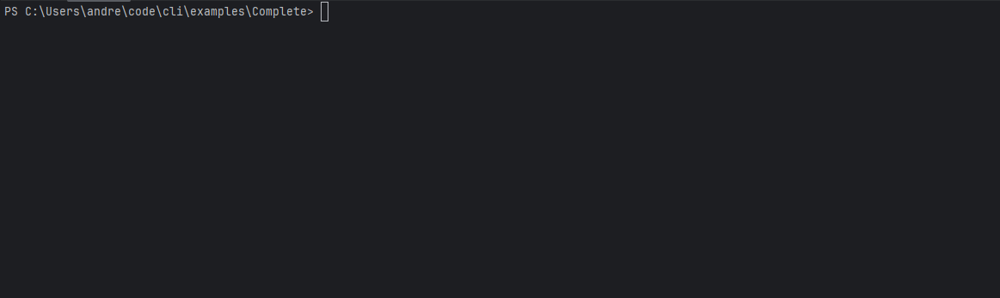

[](https://codeclimate.com/github/andreypostal/cli/maintainability)



# 🧙‍♂️ Easy CLI for PHP
A simple and easy to use library with no dependencies for creating pretty and organized CLI apps in PHP.

No dependencies, simple and easy to understand. You can create simple CLI tools or complex one and things wont get messy!! 😄


## Installation

```
composer require andreypostal/cli
```

## Basic Usage

```php
$app = new App(
    appName: 'MyApp',
    description: 'My app has a cool description',
    cmd: 'php cmd',
    params: [],
    commands: [
        new Command(
            key: 'run',
            description: 'This action will run soon',
            service: [
                'handler' => static function(Context $context): void {
                    App::console('It is so easy!!!');
                },
            ],
        ),
    ],
);
$app->run($argv);
```

## Docs

- [01 - Usage / Getting started](./doc/01-usage.md)
- [02 - Utilities](./doc/02-utilities.md)
- [03 - Components](./doc/03-components.md)

## Examples

- [Basic Handler](examples/BasicHandler)
- [Basic Service](examples/BasicService)
- [Required Params Validation](examples/ParamsValidation)
- [Boolean Flag](examples/BooleanFlag)
- [Progress Bar](examples/ProgressBar)
- [Infinite Progress Bar](examples/InfiniteProgressBar)
- [Complete](examples/Complete)

## About

### Author

Andrey Postal - <andreypostal@gmail.com> <br />


### License

CLI is licensed under the Apache License 2.0 - see the [LICENSE](LICENSE) file for details

### Acknowledgements

Highly inspired by the Go library [urfave/cli](https://github.com/urfave/cli)
