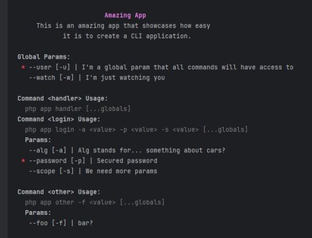

# Using CLI

- [Installation](#installation)
- [Get started](#get-started)
- [Core Concepts](#concepts)
  - [App](#app)
  - [Command](#command)
  - [Param](#param)
  - [Service](#service)
  - [Context](#context)

## Installation
```
composer require andreypostal/cli
```

## Get started

> For a basic and straight-forward project check [this example](./../examples/BasicHandler).

The main idea is **keep things simple**. To start your new **CLI project**
you will need to create a new [App](./../src/App.php) or extend it in a command
class like we did in the [Complete Example](./../examples/Complete).

In order to create a new app you have to define some information like the App
name, description and cmd. This information will be used by **the builtin
helper command** ``php myapp help`` to produces the result below.

<div style="text-align: center;">
    
</div>

## Concepts
A quick overview for the core concepts used in the library

### App
The app is the main container for the application. On it, you will define
the **commands** and can also add global parameters that all the commands
will have access to.

```php
new App(
    appName: 'Amazing App',
    description: 'With an amazing description',
    cmd: 'php app',
    params: [ ... ],
    commands: [ ... ],
);
```

### Command
A command is an **action** itself. Is where the **application behavior should be
implemented**. We can have multiple instances in an application, and we can define
the parameters that are only valid in the context for this specific command.

> Examples: ``serve`` ``dev`` ``run`` ``clear`` ``listen`` 

```php
new Command(
    key: 'listen',
    description: 'Start some random http server',
    service: [
        'instance' => MyServer::class,
        'entrypoint' => 'init',
    ],
    params: [ ... ],
)
```

### Param
The parameters are the definitions for the data that we receive in the arguments
when calling the CLI. If a parameter is a boolean flag only (has no value) the
attribute ``isBool`` should be set to true.

```php
new Param(
    key: 'port',
    flag: 'p',
    required: false,
    helpText: 'Port where the server will listen',
    defaultValue: '80',
    isBool: false,
);
```

### Service
The service is the caller to the implementation itself. Here is where the real
action happens. When calling the service we will always pass to it as an argument
the Context of the current run (see next).

Related to the definition of the service itself, it can be done in two different ways:

- By using the instance and the entrypoint (see [this example](./../examples/BasicService))
  - This approach needs to implement the following structure:
      ```php
      new Command(
          [ ... ],
          service: [
              'instance' => MyServer::class, // reference to the service class
              'entrypoint' => 'init', // method name which will be called
          ],
          params: [ ... ],
      )
      ```
- By using a handler with a closure (see [this example](./../examples/BasicHandler))
  - It is just a function that receive the Context and process the command
     ```php
      new Command(
          [ ... ],
          service: [
              'handler' => static function(Context $context): void {
                  App::console('And you can do some action here');
              },
          ],
          params: [ ... ],
      )
      ```

### Context
The context is a wrapper for the parsed parameters. You can access any parameter
by passing its flag or key, both are accessible even when not used. If a parameter
is required, it is guaranteed that it will exist in the context (both for the key and flag)
but if it is optional a null value will be returned when the field is not
present.
