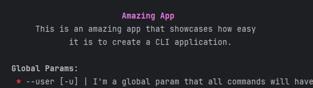

# Utilities

- [Output](#output)
- [Console Level](#console-level)

## Output
Output is a ``trait`` with static methods for writing to the console.
It is composed of three methods:
```php
public static function console(string $message, ConsoleLevel $level = ConsoleLevel::NORMAL): void
```
This method writes to the terminal in the format ``[date]: message`` using the
colors defined by the enum [Console Level](#console-level) with the level chosen.

```php
public static function center(string $message, ConsoleLevel $level = ConsoleLevel::NORMAL, int $columns = 60): void;
```
This method will centralize the message send while keeping it within the column.
If the string is bigger than the space available, it will break the string and
call itself recursively to resolve the entire string, like in the example below
where the subtitle was too big and was split in two centralized lines.
<div style="text-align: center">
    
</div>

```php
public static function newLine(bool $time = false): void;
```
The last method just prints a blank line when ``$time`` is false or prints a
line with the same pattern as the ``console`` method, but with an empty message.

## Console Level
The [Console Level](./../src/Types/ConsoleLevel.php) is an Enum which has defined the following levels:

- **NORMAL**: default text color from terminal
- **INFO**: blue
- **WARNING**: yellow
- **ERROR**: red
- **SUCCESS**: green
- **HIGHLIGHT**: bold purple
