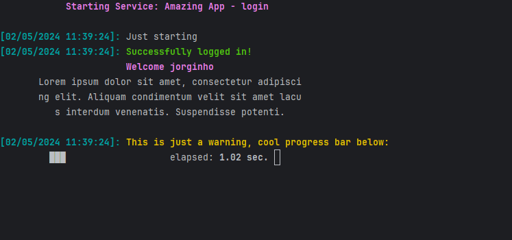
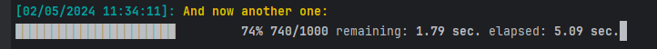

# Components

- [Progress Bar](#progress-bar)
- [Infinite Progress Bar](#infinite-progress-bar)



## Progress Bar
The [Progress Bar component](./../src/Components/ProgressBar.php) is a trait
that implements three methods:
```php
public function initProgressBar(int $total, int $barSize = 30): void
```
This method must be the first one to be called when we want to display a
progress bar. The ``$total`` parameter is a reference to the number of units
that we are considering 100% (like 1000 files or 5000 db entries that need to
be processed).

```php
public function addProgress(int $progress, string $message = ''): void;
```
The add progress method includes a ``$progress`` amount to the progress bar,
moving X percent of the bar to the goal of ``$total`` items defined in the 
init method.
This method should be called everytime that we want to do some update in the
progress bar state, being a 1 + 1 + 1 progress, in bulks or some random number
like in bytes for upload.



```php
public function endProgressBar(): void;
```
Once we are done with our progress bar, we should call this last method to
conclude progress bar.

## Infinite Progress Bar
Similarly to the Progress Bar, we also have three methods, one for initializing
other for updating and one last for finalizing.

```php
public function initInfiniteBar(int $barSize = 30): void;
```

```php
public function loopInfiniteBar(int $totalSteps = 20, int $blockSize = 3): void;
```
Here is the main difference. For the infinite progress bar instead of updating
a certain amount, we trigger a loop. We can control the feeling and duration of
this loop with the function parameters.

> Lower ``$totalSteps`` means faster loops but worst animation
